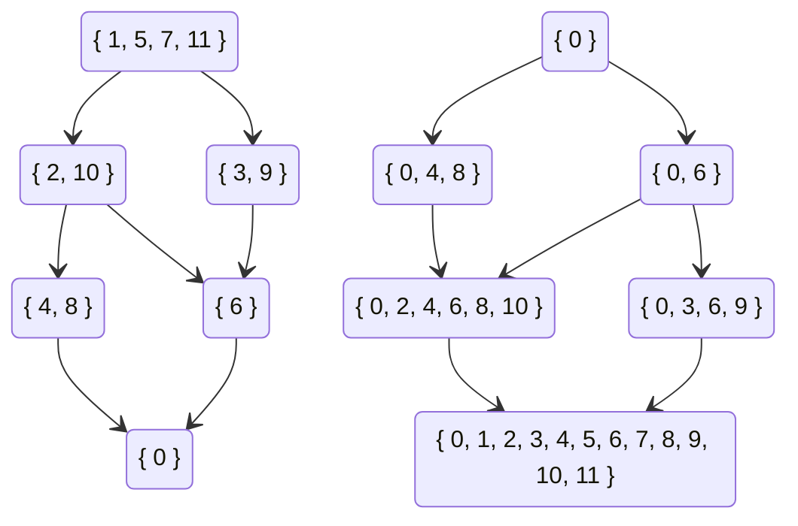

# 数论

## 初等数论

### 整除与因子

对于正整数$a,b$，若存在正整数$k$使得$ak=b$，则称$$整除$b$，记作$a|b$。

对于正整数$a,b$，若$a|b$，则我称a$是$b$的因子。

性质1：若$a|b$，则$\frac ba |b$。证明显然。

性质2：对于$n$的任何一个因子$d$，要么$d \leq \sqrt n$，要么$n / d \leq \sqrt n$（当$\sqrt n$是整数时两者均成立）。

通过性质2可以在$O(\sqrt n)$内找到$n$的所有因子。即枚举$\sqrt n$内的所有正整数$d$，检查是否有$d|n$，若是则将$d$和$\frac nd$加入因子集（注意判断是否有$d = n/d$）。

性质3（传递性）：若$a | b, b | c$，则$a | c$。证明显然。

定义（质数）：若正整数$n \geq 2$只有$1$和$n$两个因子，则称$n$为质数（或素数），否则称为合数。

定义（质因子）：若正整数$n$能被质数$p$整除，则称$p$为$n$的质因子。

定理（唯一分解定理）：每个大于$1$的正整数$n$都能唯一的写成一串不递减的素数的乘积。

证明略。

定理（质数定理）：$n$以内的素数数量是$O(n / \ln n)$级别的。证明略。

算法（埃式筛）：

找到$n$以内的所有质数可以在$O(n \log \log n)$的时间复杂度内解决。证明略。

遍历从$2$到$n$的所有正整数，对于每个质数将其所有倍数筛去，这样就得到了原始的埃式筛。

因为所有质数里面只有$2$不是奇数，所以只需要筛掉大于等于$3$的奇合数。

因为大于$2$的偶数不可能是质数，所以对于质数$p$只需要筛掉其奇数倍的数，即$3p,5p,7p,\cdots$。

当找到质数$p$时，所有最小质因子小于$p$的合数均已被筛去，因此接下来第一个未被筛去的$p$的倍数应是$p^2$。

```cpp
vector<int> eratosthenes_sieve(int n) {
    vector<int> primes;
    vector<char> is_prime(n + 1, true);
   	is_prime[1] = 0;
    for (int i = 3; i <= n; i += 2) {
        if (!is_prime[i]) continue;
        primes.push_back(i);
        for (int j = i * i; j <= n; j += 2 * i)
            is_prime[j] = false;
    }
    return primes;
}
```

算法（朴素质因数分解）：

对于合数$n$来说，其大于$\sqrt n$的质因子至多只有一个，所以只需要检查小于等于$\sqrt n$的所有素数是否能够整除$n$。

$\sqrt n$以内的素数可以预处理，因此运行$T$次$O(n)$级别的质因数分解的时间复杂度a是$O\left(\sqrt {n} \log \log n+T \sqrt {n / \log n}\right)$。

```cpp
vector<int> prime_factorization(int n) {
    vector<int> factors;
    vector<int> primes = eratosthenes_sieve((int)sqrt(n));
    for (int p : primes) {
        if (p * p > n) break;
        while (n % p == 0) {
            factors.push_back(p);
            n /= p;
        }
    }
    if (n != 1)
        factors.push_back(n);
    return factors;
}
```

### 带余除法与模运算

定义（带余除法）：给定非负整数$a,b$，存在非负整数$q,r$满足$a=bq+r(0 \leq r <b)$。其中$q$为商，$r$为余数。

在C++中，`q=a/b`而`r=a%b`。

定义（同余）：对于模数$m$，可以定义一个$\Z$上的等价关系$\equiv_m$，$a \equiv_m b$当且仅当存在整数$k$使得$a+km=b$。一般记作$a \equiv b \mod m$。

等价关系$\equiv_m$将$\Z$划分成了$m$个剩余类$\bar 0,\bar 1,\cdots ,\overline{m-1}$。

等价类之间可以定义和整数一样的加法和乘法，这里称为模意义下的加法和乘法。

模意义下的加法和乘法满足交换律、结合律、分配律。

### 欧几里得算法

命题：对于正整数$a,b$，$\gcd (a,b)=\gcd(b, a \mod b)$。

证明：设$\gcd(a,b)=d_1,\gcd(b, a \mod b)=d_2$。

由定义得存在$k_1,k_2 \in \Z$使得$a=k_1d_1,b=k_2d_1$，则$a \mod b=a-\lfloor a/b \rfloor b=(k_1-\lfloor a/b \rfloor k_2)d_1$，因此$d_1|a \mod b$。所以$d_1 | d_2$。

由定义得存在$k_1,k_2 \in \Z$使得$b=k_1d_2,a \mod b=k_2d_2$，则$a=a \mod b+\lfloor a/b \rfloor b=(k_2+k_1\lfloor a/b \rfloor )d_2$，因此$d_2 | a$。所以$d_2 | d_1$。

于是$d_1=d_2$。

算法（欧几里得）：

因为每一轮迭代中$a$与$b$的和至少减少$1$，所以算法一定能够结束。

```cpp
int euclid(int a, int b) {
    if (b != 0) return euclid(b, a % b);
    else return a;
}
```

算法（扩展欧几里得）：

对欧几里得算法进行一些修改可以求得一组系数$u,v$使得$au+bv=\gcd (a,b)$。

设欧几里得算法运行时每一轮迭代参数分别是$a_1,a_2,\cdots a_n$，其中$a_n=0$，$a_{n-1}=\gcd(a,b)$，且对于$i \geq 1$有$a_{i+2}=a_i \mod a_{i-1}$。

设$a_i=q_i a_{i+1}+a_{i+2}$，其中$q_i=\lfloor a_i / a_{i+1} \rfloor$且$u_ia_i+v_ia_{i+1}=d$，则
$$
u_ia_i+v_ia_{i+1}=u_i(q_ia_{i+1}+a_{i+2})+v_ia_{i+1}=(u_iq_i+v_i)a_{i+1}+u_ia_{i+2}=u_{i+1}a_{i+1}+v_{i+1}a_{i+2}
$$
因此$u_i=v_{i+1},v_{i}=u_{i+1}-u_{i}q_{i}$。

迭代终点为$1 \cdot a_{n-1}+0\cdot a_n=\gcd(a,b)$。

```cpp
pair<int, int> ext_euclid(int a, int b) {
    if (b != 0) {
        pair<int, int> res = ext_euclid(b, a % b);
        return { res.second, res.first - (a / b) * res.second };
    }
    else return { 1, 0 };
}
```

### 一次不定方程

定义（二元一次不定方程）：形如$ax+by=c$的方程称为二元一次不定方程，其中$a,b,c$已知。

先考虑$c=0$的情况。（不要问为什么）

命题：设$x_0$为使得方程$ax_0+by=0$有整数解$y=y_0$的最小正整数，则对于方程$ax+by=0$的任意解$x,y$均存在$k$使得$x=kx_0,y=ky_0$。

证明：若$ax_1+by_1=0$且$x_0\nmid x_1$，将$x_1$除以$x_0$得$x_1=qx_0+r(0< r < x_0)$，则有$a(x_1-qx_0)+b(y_1-qy_0)=0$。令$x_2=x_1-qx_0,y_2=y_1-qy_0$，显然$x_2=r<x_0,y_2$是比$x_0$更小的正整数解，导出矛盾。因此不存在$x_1,y_1$使得$x_0 \nmid x_1$且$ax_1+by_1=0$，得证。

注意到$b|ax_0$，因此$ax_0$是$a$与$b$的最小公倍数。即$ax_0=\text{lcm} (a, b)=\frac{ab}{\gcd(a,b)}$

命题：不妨设$b>0,d = \gcd (a, b)$，则$x_0=\frac bd,y_0=-\frac ad$。

结论：二元一次不定方程$ax+by=0$的解集是$\{(x,y)|k \in \Z ,x=\frac {kb}{d},y=-\frac {ka}{d}\}$。其中$d=\gcd (a,b)$。

注意到若能够找到任意一组$x^*, y^*$使得$a x^*+by^*=c$，则方程$ax+by=c$的解集可以写成$\{(x,y)|k \in \Z ,x=\frac {kb}{d}+x^*,y=-\frac {ka}{d}+y^*\}$。其中$d=\gcd (a,b)$。

上一节中的扩展欧几里得算法可以用来解决寻找$x^*,y^*$的问题。

运行扩欧后得到$(u,v)$使得$au+bv=d$，若$d \nmid c$则方程无解（证明思路同上）。否则有$x^*=\frac {cu}{d},y^*=\frac{cv}{d}$。

总结一下，二元一次不定方程$ax+by=c$的解集是

$$
\{(x,y)|k \in \Z, x=\frac{kb+cu}{d},y=\frac{-ka+cv}{d}\}
$$

其中$u,v,d$为使用扩展欧几里得算法解$au+bv=d$所得。

### 一次同余方程

模意义下的除法问题可以描述为解一次同余方程$ax \equiv b \mod m$。

定义（一次同余方程）：对于模数$m$，给定$a,b$求$x$使得$ax \equiv b \mod m$。

由同余的意义可得，一次同余方程的解集与不定方程$ax + my = b$的解集相同，即$x=\frac{km+bu}{d}$，也可写成$$x \equiv \frac {bu}{d} \mod \frac md$$

在模$m$的意义下为以下同余类：$$\overline{\frac md+\frac {bu}d},\overline{\frac {2m}d+\frac {bu}d}，\cdots$$

一次同余方程在当$b=1,\gcd(a,m)=1$时一定只有一个解$x$，定义$x$为$a$在模$m$意义下的乘法逆（逆元），记为$x=a^{-1}$。

命题：对于质数$p$，求$1$到$n$内所有数的逆元可用以下递推式求解：
$$
a^{-1}\equiv (p \mod a)^{-1}(p - \lfloor p/a\rfloor)
$$
设$p=qa+r(0 \leq r <a)$，则
$$
\left((p-q)r^{-1}\right)a=(p-q)r^{-1}(p-r)/q\equiv(p-q)(r^{-1}p-1)q^{-1}\mod p\\
=r^{-1}q^{-1}p^2-(r^{-1}+q^{-1})p+1\equiv1 \mod p
$$

递推边界条件为`inv[1]=1`。时间复杂度$O(n)$。

### 一次同余方程组

定义（一次同余方程组）：形如

$$
\begin{cases}
x & \equiv & b_1 \mod m_1\\
x & \equiv & b_2 \mod m_2\\
& \vdots &\\
x & \equiv & b_n \mod m_n
\end{cases}
$$

称为一次同余方程组。

命题：一次同余方程组的解是一次同余式。证明略。

定理（中国剩余定理）：当$m_i$两两互质时，方程组有解

$$
x \equiv \sum_{i=1}^{n} b_iu_iv_i \mod M
$$

其中
$$
M=\prod_{i=1}^{n}m_i,u_i=\frac{M}{m_i},u_iv_i \equiv 1 \mod m_i
$$

证明：考虑第$i$项，因为$\gcd(u_i, m_i)=1$，所以$v_i$存在且唯一。因为当$i \neq j$时有$m_j|u_i$，所以$b_iu_iv_i \equiv 0 \mod m_j$，否则有$b_iu_iv_i \equiv b_i \mod m_i$。因此第$i$项对第$i$个方程的贡献是$b_i$，对其他方程都是$0$。

从另一个角度来考虑，即将两个一次同余方程合并。

考虑不定方程

$$
b_1+k_1m_1=b_2+k_2m_2
$$

移项

$$
k_1m_1-k_2m_2=b_2-b_1
$$

对$m_1u+(-m_2)v=d$运行扩展欧几里得算法解得$u,v,d$

则解为

$$
k_1=\frac{(b_2-b_1)u-km_2}{d},k_2=\frac{(b_2-b_1)v-km_1}{d}
$$

代入原式

$$
b_1+\frac{(b_2-b_1)um_1}{d}-k\frac{m_1m_2}{d}=b_2+\frac{(b_2-b_1)vm_2}{d}-\frac{km_1m_2}{d}
$$

解得

$$
x\equiv b_1+\frac{(b_2-b_1)um_1}{d} \mod \frac{m_1m_2}{d}
$$

将同余式依次合并至$x \equiv 0 \mod 1$即可解出模数任意的一次同余方程组。

## 顶和底

定义（顶和底）：给定实数$x$，将$\lfloor x \rfloor$定义为小于等于$x$的最大整数，$\lceil x\rceil$定义为大于等于$x$的最小整数。

命题：对于正整数$a,b,c$有$\lfloor\lfloor a / b\rfloor /c \rfloor=\lfloor a/(bc)\rfloor$。

证明：设$a = q_1b+r_1(0 \leq r_1 <b)$，$q_1=q_2c+r_2(0 \leq r_2 < c)$，因为$a=(q_2c+r_2)b+r_1=q_2bc+r_2b+r_1$，而$r_2b+r_1\leq (c-1)b+(b-1)=bc-1<bc$，所以$\lfloor\lfloor a / b\rfloor /c \rfloor=q_2=\lfloor a/(bc)\rfloor$。

命题：对于正整数$n,x(x \leq \sqrt n)$有$\lfloor n / \lfloor n / x \rfloor \rfloor=x$。

证明：设$n = qx +r(0 \leq r < x),n=tq+s(0 \leq s < q)$。因为$0 \leq r <x \leq \sqrt n\leq q$，所以$s=r,t=x$。

命题：对于正整数$n,x(x<n)$，有$\lfloor n/ \lfloor n/\lfloor n/x\rfloor\rfloor\rfloor=\lfloor n/x\rfloor$。

证明：若$x \leq \sqrt n$，则可将$\lfloor n/\lfloor n/x\rfloor\rfloor$换成$x$。否则$\lfloor n/x \rfloor \leq \sqrt n$，则可将外两层去掉。得证。

命题：对于正整数$n,x(x<n)$，若存在$a$使得$\lfloor n/a\rfloor=x$，则$\max \{ a|\lfloor n/a \rfloor=x\}\leq \lfloor n/x \rfloor$。

证明：设$n=ax+b(0 \leq b < a)=qx+r(0 \leq r < x)$，则$a = (r-b)/x+q \leq r/x+q<x/x+q=q+1$

因此$a \leq q= \lfloor n/x \rfloor$。

命题：对于正整数$n,u(u<n)$，$\max \{v|\lfloor n/v\rfloor=\lfloor n/u\rfloor\}=\lfloor n/\lfloor n/u\rfloor\rfloor$。

因为$\lfloor n/\lfloor n/\lfloor n/u\rfloor\rfloor\rfloor=\lfloor n/u\rfloor$，且由上个命题有$v \leq \lfloor n/\lfloor n/u\rfloor\rfloor$，因此加上条件$x=\lfloor n/u\rfloor$后上一个命题中的等号成立。

命题：对于正整数$n$，集合$S=\{\lfloor n/i \rfloor|1 \leq i \leq n\}$的大小为$2s-[\lfloor i/s\rfloor=s]$，其中$s=\lfloor \sqrt n \rfloor$。

引理：对于正整数$n$，不大于$\sqrt n$的任意两个不相等的正整数$x,y$满足$\lfloor n/x \rfloor \neq \lfloor n/y \rfloor$。

证明：设$n = qx+r(0 \leq r < x)$，则$\lfloor n/x \rfloor=q$。因为$q \geq \sqrt n \geq x > r$，所以$q(x+1)=qx+q>qx+r=n$。所以$\lfloor n/(x+1) \rfloor < \lfloor n/x \rfloor$。不妨设$x < y$，即得$\lfloor n/y \rfloor <\lfloor n/(y-1) \rfloor< \cdots < \lfloor n/x \rfloor$。得证。

算法（整除分块）：由前两个条件可以在$O(\sqrt n)$内求出形如
$$
\sum_{x=1}^{n}f(\lfloor n/x\rfloor)
$$
的和式的值。（若$f$能$O(1)$求得）

因为$\lfloor n/x \rfloor$的取值只有$O(\sqrt n)$种，且对于一个$l$可以直接求出相同取值的右端点$r=\lfloor n/ \lfloor n/l \rfloor \rfloor$。

```
int sum = 0;
for (int l = 1, r; l <= n; l = r + 1) {
	r = n / (n / l);
	sum += (r - l + 1) * f(n / l);
}
```

注：求值范围为$L \leq x \leq R$时也可以只用一次for完成。

## 积性函数

定义（数论函数）：定义域在正整数上，且值域中元素能互相做加法和乘法（即在某个交换环中）的函数称为数论函数。

定义（积性函数）：给定数论函数$f$，若对任意互质的$a,b$有$f(ab)=f(a)f(b)$，则称$f$为积性函数。

命题：$f(1)=1$。证明显然。

命题：给定任意一个积性函数在所有质数的幂次$p^e$上的取值，则可以唯一确定这个积性函数。

证明：对于任意正整数$n$，考虑$n$的质因子分解$\displaystyle n=\prod p_i^{q_i}$，则$\displaystyle f(n)=\prod f(p_i^{q_i})$。

涉及到积性函数的计算中经常出现对某个函数$f$在某个数$n$的所有因子位置上的值求和，这个符号记为$\displaystyle \sum_{d|n}f(d)$。

即对所有能够整除$n$的数$d$统计$f(d)$的和。

### 除数函数

定义（除数函数）：$d(n)$为$n$的因子数量。

命题：设$n$的质因子分解为$\displaystyle n=\prod p_i^{q_i}$，则$\displaystyle d(n)=\prod(q_i+1)$。

证明：对于$n$的任意因子$x$，$x$的每个质因子的在$x$中幂次必然小于等于其在$n$中的幂次。因此对于在$n$中幂次为$q_i$的质因子，其在$n$的因子中有$q_i+1$种可能，且与其他质因子互相独立。

命题：除数函数是积性函数。

证明：由上式显然。

命题：$d(n)$的前缀和是$O(n \log n)$级别的。

证明：
$$
\sum_{i=1}^nd(n)=\sum_{i=1}^n\sum_{j | i}1=\sum_{j=1}^n\sum_{j | i}1=\sum_{j=1}^n\left\lfloor\frac nj \right\rfloor \leq n\sum_{j=1}^n\frac1j =O(n\log n)
$$


### 欧拉函数

定义（欧拉函数）：$\varphi(n)$为$1$到$n-1$中与$n$互质的数的数量。

命题：设$n$的质因子分解为$\displaystyle n=\prod p_i^{q_i}$，则$\displaystyle \varphi(n)=n\prod(1-\frac{1}{p_i})$。

证明：考虑容斥。设$n$的质因子分别是$p_1,p_2,\cdots,p_k$，则$1$到$n$能被$p_i$整除的数的数量是$n/p_i$，能被$p_ip_j$整除的数量是$n/p_ip_j$，由此可以写出
$$
\varphi(n)=n-\sum_{1 \leq i \leq k}\frac n{p_i}+\sum_{1 \leq i < j \leq k}\frac n{p_ip_j}- \cdots=n\left(1-\frac{1}{p_1}\right)\left(1-\frac{1}{p_2}\right)\cdots\left(1-\frac{1}{p_k}\right)
$$
注：将右边展开，每带上一个质因子都会乘上一个$-1$，因此每一项的符号为$(-1)^{质因子数量}$

命题：欧拉函数是积性函数。

证明：由上式显然。

命题：$\sum_{d|n}\varphi(d)=n$

证明：
$$
\sum_{d|n}\varphi(d)=\sum_{d|n}\varphi\left(\frac nd\right)=\sum_{d|n}\sum_{i=1}^{\frac nd}[\gcd\left(i,\frac nd\right)=1]\\
=\sum_{d|n}\sum_{k=1}^n[\gcd(k,n)=d]=n
$$
注：$\varphi(n/d)$等于$1,2,\cdots,n$内和$n$的$\gcd$为$d$的数的数量。

命题：$n$以内的欧拉函数值可在$O(n \log n)$的时间复杂度内计算出来。

由上一个命题可得$\varphi(n)=n-\sum_{d|n,d \neq n}\varphi(d)$。

```cpp
int phi[N];
void get_phi(int n) {
    for (int i = 1; i <= n; ++i) {
        phi[i] = i;
        for (int j = 2 * i; j <= n; j += i)
            phi[j] -= phi[i];
    }
}
```

### 默比乌斯函数

定义（默比乌斯函数）：
$$
\mu(n)=\begin{cases}(-1)^{k} & n=p_1p_2\cdots p_k\\1&n=1\\0&else\end{cases}
$$

命题：若$n$有平方因子，则$\mu(n)=0$。由定义显然。

命题：默比乌斯函数是积性函数。

证明：若$a,b$中任意一个有平方因子，则$ab$也有平方因子，因此$\mu(ab)=\mu(a)\mu(b)=0$。

若$a,b$均没有平方因子且互质，则$ab$也能写成一串不同质数的乘积，因此$\mu(n)=(-1)^{k_a+k_b}=(-1)^{k_a}(-1)^{k_b}=\mu(a)\mu(b)$。得证。

命题：$\sum_{d|n}\mu(n)=[n=1]$。

证明：$n=1$时显然成立。

当$n \neq 1$时，设$n$有$k$个不同的质因子$p_1,p_2,\cdots,p_k$，设该集合为$S=\{p_i|1 \leq i \leq k \} $则上式可写成
$$
\sum_{S \subseteq T}(-1)^{|S|}=\sum_{i=0}^{k}\binom ki(-1)^i=(1-1)^k=0
$$
注：由定义有$\mu$在有平方因子的$n$的因子处的取值为$0$。

命题：$n$以内的默比乌斯函数值可在$O(n \log n)$的时间复杂度内计算出来。

由上个命题可得$\mu(n)=[n=1]-\sum_{d|n,d \neq n}\mu(d)$

```cpp
int mu[N];
void get_mu(int n) {
    mu[1] = 1;
    for (int i = 1; i <= n; ++i)
        for (int j = 2 * i; j <= n; j += i)
            mu[j] -= mu[i];
}
```

### 狄利克雷卷积

定义（狄利克雷卷积）：设$f,g$为数论函数，则$f,g$的狄利克雷卷积$h = f * g$被定义为
$$
h(n)=\sum_{d|n}f(d)g\left( \frac n d \right)
$$
命题：若$f,g$都是积性函数，则$f,g$的狄利克雷卷积也是积性函数。

证明：
$$
h(n_1n_2)=\sum_{d|n_1n_2}f(d)g\left(\frac nd\right)=\sum_{d_1|n_1}\sum_{d_2|n_2}f(d_1d_2)g\left(\frac{n_1n_2}{d_1d_2}\right)\\
=\sum_{d_1|n_1}\sum_{d_2|n_2}f(d_1)f(d_2)g\left(\frac{n_1}{d_1}\right)g\left(\frac{n_2}{d_2}\right)=\sum_{d_1|n_1}f(d_1)g\left(\frac{n_1}{d_1}\right)\sum_{d_2|n_2}f(d_2)g\left(\frac{n_2}{d_2}\right)
=h(n_1)h(n_2)
$$
命题：狄利克雷卷积满足交换律。

证明：
$$
(f*g)(n)=\sum_{d|n}f(d)g\left( \frac n d \right)=\sum_{d|n}f\left( \frac n d \right)g(d)=(g*f)(n)
$$


命题：狄利克雷卷积满足结合律，即$(f*g)*h=f*(g*h)$。

证明：
$$
((f*g)*h)(n)=\sum_{d_1|n}\left(\sum_{e_1|d_1}f(e_1)g\left(\frac {d_1}{e_1}\right)\right)h\left(\frac n{d_1}\right)
$$
设$d_2=\frac{n}{e_1},e_2=\frac{n}{d_1}$，则有
$$
=\sum_{d_2|n}f\left(\frac{n}{d_2}\right)\left(\sum_{e_2|d_2}g\left(\frac{d_2}{e_2}\right)h(e_2)\right)=(f*(g*h))(n)
$$
命题：设$f_1,f_2,\cdots,f_k$为数论函数，则
$$
(f_1*f_2*\cdots*f_k)(n)=\sum_{d_1d_2\cdots d_k|n}f_1(d_1)f_2(d_2)\cdots f_k(d_k)
$$
证明：由定义一层层展开即可。

定义（单位函数）：$e(n)=[n=1]$。

命题：对于任意数论函数$f$有$f * e=1$。

定义（常数函数）：$1(n)=1$

定义（恒等函数）：$id (n)=n$，类似的有$id^k(n)=n^k$。

命题：$\mu * 1=e$。由定义显然。

这个命题能让展开形如$[\gcd(x,y,z,\cdots)=1]$的部分进行化简。

例1：求$m$以内与$n$互质的数的个数。
$$
f(m,n)=\sum_{i=1}^{m}[\gcd(i,n)=1]=\sum_{i=1}^me(\gcd(i,n))=\sum_{i=1}^m\sum_{e|\gcd(i,n)}\mu(e)\\=\sum_{i=1}^m\sum_{e|i \wedge e|n}\mu(e)=\sum_{e|n}\mu(e)\sum_{e|i\wedge i \leq m}1=\sum_{e|n}\mu(e)\left\lfloor\frac me \right\rfloor
$$
例2：求$m$以内与$n$的$\gcd$为$d$的数的个数
$$
g(m,n,d)=\sum_{i=1}^m[\gcd(i,n)=d]=\sum_{d|i \wedge i \leq m}[\gcd(i,n)=d]=\sum_{j=1}^{\lfloor m/d\rfloor}[\gcd(j,n/d)=1]=f(m/d,n/d);
$$
命题：$\varphi *1=id$。因为$(\varphi * 1)(n)=\sum_{d|n}\varphi(d)=n$。

命题：$\sum_{d|n}\mu(d)/d=\varphi(n)/n$

证明：
$$
\varphi(n)=(\varphi*1*\mu)(n)=(id*\mu)(n)=\sum_{d|n}\mu(d)\frac{n}{d}\\
$$
两边同除$n$即可。

定理（默比乌斯反演）：对于积性函数$f$，设$g=f*1$，则$f=g*\mu$。

将每项写出来即是
$$
g(n)=\sum_{d|n}f(d) \Leftrightarrow f(n)=\sum_{d|n}\mu(n/d)g(d)
$$
证明：$g*\mu=(f*1)*\mu=f*(1*\mu)=f$。

同时也有
$$
g(d)=\sum_{d|n}f(n) \Leftrightarrow f(d)=\sum_{d|n}\mu(n/d)g(n)
$$
证明：
$$
\sum_{d|n}\mu(n/d)g(n)=\sum_{d|n}\mu(n/d)\sum_{n|m}f(m)=\sum_{d|m}f(m)\sum_{d|n|m}\mu(n/d)\\=\sum_{d|m}f(m)\sum_{T|\frac md}\mu(t)=\sum_{d|m}f(m)[m/d=1]=f(d)
$$
例(CF1139D)：有一个空数列$\{ a \}$，每一轮向$\{ a \}$中加入一个范围在$[1,m]$内的随机整数，当$\{ a \}$中所有数的$\gcd$为$1$时停止，问停止时$\{ a \}$的长度$X$的期望值。
$$
E[X]=\sum_{i=1}^{\infty}iP[X=i]=\sum_{i=1}^{\infty}P[X\geq i]\\
$$
当$i=1$时$P[x\geq 1]=1$，否则$P[X \geq i+1]=P[X>i]$，即长度为$i$的值域在$[1,m]$内的随机数列的$\gcd$不为$1$的概率。

设$f(d)$为$d=\gcd \{a\}$的数列$\{a\}$数量，$g(d)$为$d|\gcd\{a\}$的数列$\{a\}$数量，则有
$$
g(d)=\lfloor m/d \rfloor^i =\sum_{d|n}f(n)\Rightarrow f(d)=\sum_{d|n}\mu(n/d)g(n)=\sum_{d|n}\mu(n/d)\lfloor m/n\rfloor^i
$$
于是
$$
P[X>i]=\frac {1}{m^i} \left(m^i-f(1)\right)=\frac {1}{m^i} \left(m^i-\sum_{n \geq 1}\mu(n)\lfloor m/n \rfloor ^i\right)\\=\frac {1}{m^i} \left(m^i-m^i-\sum_{n \geq 2}\mu(n)\lfloor m/n \rfloor ^i\right)=-\frac {1}{m^i}\sum_{n=2}^m\mu(n)\lfloor m/n \rfloor ^i
$$
因此
$$
\sum_{i=1}^{\infty}P[X\geq i]=1+\sum_{i=1}^{\infty}P[X>i]=1+\sum_{i=1}^{\infty}\left(-\frac {1}{m^i}\sum_{n=2}^m\mu(n)\lfloor m/n \rfloor ^i\right)\\=1-\sum_{n=2}^m\mu(n)\sum_{i=1}^{\infty}(\lfloor m/n \rfloor/m)^i=1-\sum_{n=2}^m\mu(n)\frac{\lfloor m/n \rfloor/m}{1-\lfloor m/n \rfloor/m}=1+\sum_{n=2}^m\mu(n)\frac{\lfloor m/n \rfloor}{\lfloor m/n \rfloor-m}
$$

## $\Z/n\Z$的结构



$\Z /n \Z$是模$n$意义下的$n$个剩余类与模$n$加法、模$n$乘法组成的代数结构，这个结构完整的刻画了模运算的性质。

对于模意义下的加法，模$n$意义下的$n$个剩余类构成了一个群$\Z_n$。$\Z_n$同构于循环群$C_n$。

对于$n$的每个因子$d$，由$d$倍数剩余类集合$\{\overline{kd}|0 \leq k < n/d\}$构成了$\Z_n$的子群。这个子群同构于$\Z_{n/d}$，即$C_{n/d}$。

子群之间的包含关系是一个典型的偏序关系，由此可以画出哈斯图。如上面的$\Z_{12}$。

## 筛法

### 区间筛


### 欧拉筛

前面提到的埃式筛的时间复杂度是$O(n \log \log n)$，没能做到线性复杂度的原因是有一些合数可能被筛去多次（如$36$被$2$和$3$分别筛了一次）。

欧拉筛做到了线性的时间复杂度，即$O(n)$内找到$n$以内的所有质数。

对于每个最小质因子为$p$的合数$i$，欧拉筛遍历小于等于$p$的所有质数$q$并将$qi$筛去。

因为对于最小质因子为$q$的合数$j$，$j/q$的最小质因子大于等于$q$，所以其必定会被$j/q$筛去。注意到这个分解有唯一性，所以其只会被$j/q$筛去。

每个合数只被筛去一次，因此欧拉筛时间复杂度是线性的。

欧拉筛的性质很适合用来处理一些积性函数的值。

考虑对于积性函数$f$，当筛去合数$qi$时如何计算$f(qi)$ 。

若$q \nmid i$，则$f(qi)=f(q)f(i)$。否则设$q$在$qi$中的幂次为$e$，则$f(qi)=f(q^e)f(qi/q^e)$。

因此需要快速获得积性函数在质数幂次处的取值，还需要预处理对于合数$i$，其最小质因子$p$在其中的幂次$e$和$p^e$。

```cpp
bool is_prime[N];
vector<int> primes;
int pe[N], pp[N];
int f[N];
int get_f(int p, int e, int q);	//	returns f[q]; q=pow(p,e);
void euler_sieve(int n) {
    fill_n(is_prime + 1, n, true);
   	is_prime[1] = 0;
    pe[1] = 0; pp[1] = 0;
    f[1] = 1;
    for (int i = 2; i <= n; ++i) {
        if (is_prime[i]) {
            primes.push_back(i);
            pe[i] = 1;
            pp[i] = i;
            f[i] = get_f(i, 1, i);
        }
        for (int p : primes) {
            if (i * p > n) break;
            is_prime[i * p] = 0;
            if (i % p != 0) {
            	pe[i * p] = 1;
                pp[i * p] = p;
                f[i * p] = f[i] * f[p];
            }
            else {
                pe[i * p] = pe[i] + 1;
                pp[i * p] = pp[i] * p;
                f[i * p] = get_f(p, pe[i * p], pp[i * p]) * f[i / pp[i]];
                break;
            }
        }
    }
}

```

对于常见的积性函数，`get_f`的取值如下

$d(n):$`getf_(p,e,q)=(e+1)`。

$\mu(n):$`get_f(p,e,q)=(e==1?-1:e==0);`

$\varphi(n):$`get_f(p,e,q)=(e==0?1:(q/p)*(p-1))`。

上面的代码对于$\mu,\varphi$等简单的积性函数还能进一步简化。

### 杜教筛

有一些问题涉及到求解积性函数的前缀和，且线性的时间复杂度无法满足要求。

给定积性函数$f$，若存在积性函数$g,h$满足$f*g=h$且$g$和$h$的前缀和能够很快求出，则可用下面的式子
$$
S_h(n)=\sum_{i=1}^nh(i)
=\sum_{i=1}^n\sum_{d|i}g(d)f\left(\frac id\right)
=\sum_{d=1}^ng(d)\sum_{d|i,i \leq n}f\left(\frac id \right)\\
=\sum_{d=1}^ng(d)\sum_{j=1}^{\left \lfloor \frac nd \right \rfloor}f(j)
=\sum_{d=1}^ng(d)S_f\left(\left \lfloor \frac nd \right \rfloor\right)
=g(1)S_f(n)+\sum_{d=2}^ng(d)S_f\left(\left \lfloor \frac nd \right \rfloor\right)\\
S_f(n)=\left(S_h(n)-\sum_{d=2}^ng(d)S_f\left(\left \lfloor \frac nd \right \rfloor\right)\right)/g(1)=S_h(n)-\sum_{d=2}^ng(d)S_f\left(\left \lfloor \frac nd \right \rfloor\right)
$$
递归求出$S_f(n)$的值。利用整除分块并记忆化，则计算$f(n)$时需要进行$2\sqrt n$次求和，因此最终的复杂度是
$$
T(n)=\sum_{i=1}^\sqrt n{\sqrt i}+\sum_{i=1}^{\sqrt n}\sqrt {n/i}\leq \int_0^\sqrt n\left(\sqrt n+\sqrt {n/i}+C\right)=O(n^{3/4})
$$
注：其中$C$为某个小常数。

若利用欧拉筛提前筛出前$n^{2/3}$的值，则最终的时间复杂度为
$$
T(n)=O(n^{2/3})+\sum_{i=1}^{\sqrt[3]{n}}\sqrt{n/i}=O(n^{2/3})
$$

记忆化可以不用`unordered_map`，因为只需要存储$S_f$在$\lfloor n/x \rfloor$位置的取值，所以对于$x \geq \sqrt n$可以将$S_f(x)$放在记忆化数组的下标$\lfloor n/x\rfloor$处。

```cpp
namespace sieve {

const int N = 1000001;
int sf[N];				//	f的前缀和，用欧拉筛取得
ll sg(ll n);			//	计算g的前缀和
ll sh(ll n);			//	计算h的前缀和
void eulerian_sieve();	//	...
    
int m[N]; ll n;

int cal(ll x) {
    if (x < N) return sf[x];
    int& sum = m[n / x];
    if (sum != -1) return sum;
    sum = sh(x);
    for (ll l = 2, r; l <= x; l = r + 1) {
        r = x / (x / l);
        sum = sub(sum, mul(sub(sg(r % P), sg((l - 1) % P)), cal(x / l)));
    }
    return sum;
}

//	init之后可O(1)获得所有n/x位置的取值
void init(ll n_) {
    n = n_;
    fill_n(m, (int)sqrt(n) + 2, -1);
    cal(n);
}
    
}
```

例：设$f(n)=\varphi(n)n^2$，求$f(n)$的前缀和。$n \leq 10^9$。

解：设$g=id^2$，则
$$
(f*g)(n)=\sum_{d|n}d^2\varphi\left(\frac nd \right)\frac{n^2}{d^2}=n^2\sum_{d|n}\varphi\left(\frac nd \right)=n^3=h(n)
$$

### min25筛

给定积性函数$f$，若$f$在质数位置上的取值是一个多项式$P_f(x)$且对于任意质数$p$，$f(p^e)$可以快速求，则可在$O(n^{3/4}/\log n)$的时间复杂度内求出$\displaystyle \sum_{i =1}^nf(i)$。

算法共分两步。

第一步筛出$f$在$n$以内质数位置上的取值之和

第二步将合数位置上的取值加回去。

#### 第一步：求$g_k(i,n)$

定义：

$Primes$为质数集合，$p_i$为第$i$个质数，$\pi(x)$为$x$以内的质数个数，$m_x$为$x$的最小质因子。特别的，$m_1=1$。

$S_f(n)$为$f$的前缀和，即$\displaystyle S_f(n)=\sum_{i =1}^nf(i)$

$S(i,n)$为埃式筛运行过程中筛掉$1$和最小质因子属于前$i$个质数的合数后剩下来的数集

$f(x)$在质数位置取值相同的多项式$\displaystyle P_f(x)=\sum_{k=0}^Ka_kx^k$

$g_k(i,n)$为$x^k$在$S(i,n)$处的取值之和，即$\displaystyle g_k(i,n)=\sum_{x \in S(i,n)}x^k$

下标从$1$开始的等幂求和$\displaystyle S_k(x)=\sum_{x=1}^nx^k$

则由定义有
$$
S(i,n)=[n]-\{x|x \notin Primes \wedge m_x \leq p_i\}=\{x|x\leq n \wedge (x \in Primes \vee m_x>p_i)\}
$$
接下来考虑递推$g(i,n)$。

初始条件为除了$1$之外所有$n$以内的正整数之和，即$g_k(0,n)=S_k(n)-1$。

因为大于$\sqrt n$的质数无法筛去$n$以内的任何合数，所以
$$
\sum_{x \in Primes \wedge x \leq n}x^k=g_k(\infty,n)=g_k(\pi(\sqrt x),n)
$$
因此递推到不大于$\sqrt n$的质数就可以终止了。

不难看出要求的即是
$$
\sum_{ x \leq n \wedge x \in Primes}f(x)=\sum_{ x \leq n \wedge x \in Primes}P_f(x)=\sum_{ x \leq n \wedge x \in Primes}\sum_{k=0}^Ka_kx^k\\=\sum_{k=0}^Ka_k\sum_{ x \leq n \wedge x \in Primes}x^k=\sum_{k=0}^Ka_k g_k(\infty,n)=\sum_{k=0}^Ka_k g_k(\pi(\sqrt x),n)
$$
从$g(i-1,n)$转移到$g(i,n)$过程中筛去的是最小质因子为$p_i$的合数（余下部分的质因子均大于等于$p_i$）。
$$
S(i,n)=S(i-1,n)-\{x|x \notin Primes \wedge m_x=p_i\}\\
g_k(i,n)=g_k(i-1,n)-\sum_{x\leq n \wedge m_x =p_i}x^k\\
=g_k(i-1,n)-p_i^k\sum_{x\leq \lfloor n / p_i \rfloor \wedge m_x \geq p_i }x^k
$$
注意到
$$
\{x|m_x \geq p_i \wedge x\leq \lfloor n / p_i \rfloor\}=S(i-1,\lfloor n / p_i \rfloor)-\{p_j|j \leq i-1\}
$$
定义$x^k$在前$i$个质数位置上的取值之和为$t_k(i)$，即$t_k(i)=\sum_{j=1}^{i}p_j^k$

于是
$$
\sum_{x,{m_x \geq p_i \wedge x\leq \lfloor n / p_i \rfloor}}x^k=g_k(i,\lfloor n / p_i \rfloor)-t_k(i)\\
$$

代入即可得递推式
$$
g_k(i,n)=g_k(i-1,n)-p_i^{k}\left[g_k(i,\lfloor n / p_i \rfloor)-t_k(i)\right]
$$
因为有$\lfloor \lfloor a/b\rfloor/c\rfloor=\lfloor a/(bc)\rfloor$，所以只要求出所有$g_k(i,\lfloor n/x \rfloor)$即可。

#### 第二步：求$s(i,n)$

接下来考虑倒过来将前面的步骤反过来。这一步需要快速求$f(p^e)$。

定义$\displaystyle s(i,n)= \sum_{x \in S(i,n)}f(x)=\sum_{x \leq n \wedge m_x>p_i}f(x)$

边界为$\displaystyle s(\pi(\sqrt n),n)=\sum_{k=0}^Ka_k\left(g_k(\pi(\sqrt n),n)-t_k(\pi(\sqrt n))\right)$

且若$p_{i+1}>n$，则$m_x \geq p_{i+1}$，所以$s(i,n)=0$。

最终要求的即是$S_f(n)=1+s(0,n)$。

从$s(i,n)$转移到$s(i-1,n)$需要将最小质因子为$p_i$的数加上。因为$f$不一定像$x^k$一样是完全积性的，所以需要枚举$p_i$在这些合数中的幂次$e$。
$$
s(i-1,n)=s(i,n)+\sum_{x\leq n\wedge m_x=p_i}f(x)\\
=s(i,n)+\sum_{e=1,p_i^e \leq n}\sum _{x\leq \lfloor n/p_i^e\rfloor \wedge m_x>p_i}f(xp_i^e)\\
=s(i,n)+\sum_{e=1,p_i^e \leq n}f(p_i^e)s(i,\lfloor n/p_i^e\rfloor)
$$
注意到满足$x\leq \lfloor n/p_i^e\rfloor \wedge m_x>p_i$的数集
$$
\{x|m_x > p_i \wedge x\leq \lfloor n / p_i^e \rfloor\}=S(i,\lfloor n / p_i^e \rfloor)-\{p_j|j \leq i \wedge p_j \leq \lfloor n/p_i^e \rfloor \}
$$
因此
$$
s(i-1,n)=s(i,n)+\sum_{e=1,p_i^e \leq n}f(p_i^e)\left[s(i,\lfloor n/p_i^e \rfloor)-\sum_{k=0}^Ka_kt_k(i)\right]
$$

```cpp
namespace sieve {

const int N = 1000005, K = 2, a[K] = { P - 1, 1 };

int sk(int k, int n) {
    const int i2 = inv(2), i6 = inv(6);
    switch(k) {
        case 0: return n;
        case 1: return mul(mul(n, n + 1), i2);
        case 2: return mul(mul(n, n + 1), mul(2 * n + 1, i6));
    }
    return 114514;
}

bool ip[N]; ll ps[N], pc;
void eulerian_sieve(int n) {
    fill_n(ip + 1, n, 1); pc = 0; ip[1] = 0;
    for (int i = 2; i <= n; ++i) {
        if (ip[i]) ps[++pc] = i;
        for (int j = 1; j <= pc && i * ps[j] <= n; ++j) {
            ip[i * ps[j]] = 0;
            if (i % ps[j] == 0) break;
        }
    }
}

//  sq为sqrt(n)，r为小于等于sq的质数个数，即\pi(\sqrt n)
//  w[i]为第i大的n/x。w[1]=n, w[c]=1。
//  如果x>sq，则g_k(i,n)其在w中的位置为id1[x],否则为id2[n/x]
ll n, sq, w[N]; int c;
int id1[N], id2[N];
int t[N][K], g[N][K];

inline int& id(ll x) { return x <= sq ? id1[x] : id2[n / x]; }

void cal_g(ll n_) {
    n = n_; sq = sqrt(n_); c = 0;
    for (ll l = 1, r; l <= n; l = r + 1) {
        ll v = w[++c] = n / l; r = n / v; id(v) = c;
        for (int k = 0; k != K; ++k)
            g[c][k] = sub(sk(k, v % P), 1);
    }

    eulerian_sieve(2 * sq);
    while (ps[pc] > sq) pc--;
    for (int i = 1; i <= pc; ++i)
        for (int k = 0, q = 1; k != K; ++k, q = mul(q, ps[i]))
            t[i][k] = add(t[i - 1][k], q);
    for (int i = 1; i <= pc; ++i)
        for (int j = 1, p = ps[i]; 1ll * p * p <= w[j]; ++j)
            for (int k = 0, q = 1; k != K; ++k, q = mul(q, ps[i]))
                g[j][k] = sub(g[j][k], mul(q, sub(g[id(w[j] / p)][k], t[i - 1][k])));
}

int cal_f(int p, int e, ll q) { return p ^ e; }

int cal_s(int i, ll x) {
    int p = ps[i + 1], res = 0;
    if (p > x) return 0;
    if (!p || 1ll * p * p > x) {
        for (int k = 0; k != K; ++k)
            res = add(res, mul(a[k], sub(g[id(x)][k], t[i][k])));
    }
    else {
        ll q = p; res = cal_s(i + 1, x);
        for (int e = 1; q <= x; ++e, q *= p) 
            res = add(res, mul(cal_f(p, e, q % P), add(1, cal_s(i + 1, x / q))));
    }
    return res;
}

int cal_sf(ll n) {
    cal_g(n);
    return add(cal_s(0, n), 1);
}
    
}
```


## 素性测试与因子分解

### 
