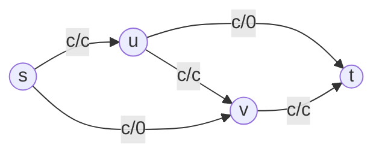
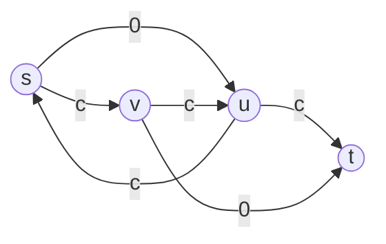

## 最大流

定义（$s-t$流）：给定一张图$G=(V,E)$和容量函数$c:E\rightarrow \R$，图$G$上的$s-t$流满足如下约束：
$$
\forall (u,v) \in E,0 \leq x_{uv} \leq c_{uv}\\
\forall v \in V, \sum_{(u,v) \in E}x_{uv}-\sum_{(v,u) \in E}x_{vu}=
\begin{cases}
-f&v=s\\
f&v=t\\
0&else
\end{cases}\\
$$
其中$s$被称为源点，$t$被称为汇点，$f$被称为流的大小。

第一行描述的是每条边的流量限制，第二行描述的是每个节点的流量平衡。

第二行的第一个和式即从该点出去的流量，第二个和式即进入该点的流量。

定义（最大流）：对于一个带容量的图$G$，其最大流即大小最大的流。

寻找最大流的一个朴素思路是每次选定一条路径，将这条路径上的流量尽可能增大，然后再寻找下一条，直到找不到为止。

定义（残量网络）：给定一个图$G=(V,E)$和容量函数$c:E\rightarrow \R$，对于其上的一个$s-t$流$f$，定义残量网络为将容量函数更换成$c':E\rightarrow \R$的流量网路且满足
$$
c'_{uv}=\begin{cases}
c_{uv}-x_{uv} & (u,v) \in E\\
x_{vu} & (v,u) \in E
\end{cases}
$$

第一种情况很好理解。对于第二种情况，考虑如下情景：

原网络的最大流应是$s\rightarrow u\rightarrow t$有$c$的流量，$s\rightarrow v \rightarrow t$也有$c$的流量，大小为$c+c=2c$。

这时前面的朴素算法无法寻找更大的流，因为无法将$(u,v)$上的流撤销。

残量网络通过引入反向边来实现撤销机制。即若一条边$(u,v)$已经有$x_{uv}$的流，而通过$s \rightarrow v$和$u \rightarrow t$都可以增加$\delta \leq x_{uv}$的流，那么将$x_{uv}$减少$\delta$并将那两条路径增加$\delta$即可在保持流量平衡的前提下找到更大的流。即此时残量网络如下:

定义（增广路）：给定容量网络$G$和流$f$，其上的$s-t$路被称为增广路当且仅当其在残量网络中的任意一条边剩余容量均大于$0$。

命题：若当前流已经是最大流，则残量网络中不存在增广路。

证明：若残量网络中存在增广路则可将增广路上流量增加来获得更大的流，矛盾。

后面可以证明残量网络中不存在增广路是当前流是最大流的充分条件。

定义（割）：给定一个图$G=(V,E)$和权函数$w:E\rightarrow \R$，定义$s-t$割为是顶点集$V$的一个2-划分。即$V=S \cup \bar S,S \cap \bar S = \emptyset,s \in S,t \in \bar S$。该割集的权被定义为$w(S,\bar S)=\displaystyle \sum_{u \in S \wedge v \in \bar S}w(u,v)$，割边集即为$\{(u,v)|u \in S \wedge v \in \bar S\}$。

性质：给定一个$s-t$割，则任意一条$s-t$路上有至少一条边属于该割的割边集。

定义（最小割）：略。

可以证明以下三个命题等价：

1. 流$f$是最大流
2. 流$f$对应的残量网络中不存在增广路
3. 存在一个与$f$相等的割

证明：

3到1：对于任意一个$s-t$割和任意一个大小为$x$的$s-t$流，将$S$中所有点的流量平衡式子加起来即得从$S$到$\bar S$的流量减去$\bar S$到$S$的流量。
$$
x=\sum_{u \in S,(u,v)\in E}x_{uv}-\sum_{u \in S,(v,u)\in E}x_{vu}=\sum_{u \in S,v \in \bar S}x_{uv}-\sum_{u \in S,v \in \bar S}x_{vu}=\\
\leq\sum_{u \in S,v \in \bar S}c_{uv}-\sum_{u \in S,v \in \bar S}c_{vu}\leq\sum_{u \in S,v \in \bar S}c_{uv}=w(S,\bar S)
$$
因此任意一个流大小小于等于任意一个割的大小。同时因为此时流与割大小相等，所以此时$f$是最大流而$(S,\bar S)$是最小割。

1到2：若存在增广路，则可将$f$继续增广。

2到3：对于一个残量网络中不存在增广路的$s-t$流，令残量网络中从$s$可达的点集为$S$，其他的为$\bar S$，则原网络中

1. 所有$S$指向$\bar S$的边均满流（对于边$(u,v)$，若$u\in S$且$x_{uv}<c_{uv}$则可通过$u$到达$v$。）
2. 所有$\bar S$指向$S$的边均无流（对于边$(u,v)$，若$v \in S$且$x_{uv}>0$则可从$v$通过其反向边到达$u$）

即此时
$$
\sum_{u \in S,v \in \bar S}x_{uv}=\sum_{u \in S,v \in \bar S}c_{uv},
\sum_{u \in S,v \in \bar S}c_{vu}=0
$$
因此
$$
x=\sum_{u \in S,v \in \bar S}x_{uv}-\sum_{u \in S,v \in \bar S}x_{vu}
=\sum_{u \in S,v \in \bar S}c_{uv}-0=w(S,\bar S)
$$
定理（最大流最小割）：对于任意一个容量网络和给定的源汇点$s,t$，最大$s-t$流的流量**等于**最小$s-t$割割边集的边权和。

定理（增广路）：对于任意一个流量网络和其上的一个$s-t$流$f$，$f$是最大流当且仅当残量网络中不存在增广路。

由这个定理可以设计出一系列基于增广路的最大流算法。

其核心思路均为不断地寻找增广路进行增广直到找不到增广路。

定理（流分解）：任意一个流都可以分解成至多$m$条增广路。

证明：当前流中流量最小的边，提取一条包含该条边且流量为该边流量的增广路。

因为这种操作每次都会将一条边上的流量降为$0$，所以这种操作至多进行$m$次，即分解成至多$m$条增广路。

### 最大流算法

#### Ford-Fulkerson

#### Edmonds-Karp

EK算法的过程即使用BFS寻找边数最少的增广路进行增广。

时间复杂度$O(nm^2)$。

#### ISAP

（我不知道为啥很多人DFS回溯时能直接将$u$的距离$+1$完事而不是像书上写的$\displaystyle d(u)=\min_{c_{uv} \geq 0} d(v)+1$，所以咕了）

#### Dinic

Dinic算法的过程为：

1. 从汇点$t$出发只通过残量网络上的反向边进行BFS，若无法到达源点则算法结束。
2. 在层次图上进行增广直到找不到增广路。

所谓层次图即在BFS后由$d(u)=d(v)+1$的边组成的图。（这里没有打错）

因为每次增广后产生的反向边均不属于层次图，且每次增广流满至少一条边，所以在每次BFS后至多进行$O(m)$次增广，每次修改$O(n)$条边的流量。

在层次图上增广后下一次BFS得到的$d(s)$一定严格大于当前$d(s)$，即至多进行$O(n)$次层次图的建立，所以Dinic算法的复杂度为$O(n^2m)$。

#### 当前弧优化

在层次图上DFS增广时，若某次尝试从一条边出发进行增广时失败了，则以后也一定无法从这条边出发进行增广，所以可以将这条边跳过。

#### 容量缩放

容量缩放算法的思路即在每轮增广后将具有最大容量的增广路的容量减少到原来的一半以下。

对于任意一个流，设当前流量与最大流的差流为$\delta$，由流分解定理可得这个差流可以被分解为至多$m$条增广路，且这$m$条增广路中有至少$1$条的增流大于等于$\delta/m$。因此当前最大容量增广路的容量至少为$\delta/m$。

考虑每次选取容量最大的增广路进行增广。尝试进行增广$2m$次后，若每次的增流都大于等于$\delta/2m$，则一定能够达到最大流。否则至少有一次增流小于等于$\delta/2m$，这代表容量最大的增广路的容量被减小了至少一半。在这个基础上进行归纳不难得到一个朴素的容量缩放算法。寻找容量最大的增广路可以通过二分容量来实现，复杂度为$O(m \log m)$，每轮增广至多$2m$次，至多$\log U$轮，因此该算法的时间复杂度为$O(m^2\log m \log U)$。

容量缩放算法不选取容量最大的增广路，而是选取容量充分大的增广路来达到一样的效果。

设网络中边的最大容量为$U$，容量缩放算法流程如下:

1. 令$z=2^{\lfloor\log U \rfloor}$。

2. 只通过残量网络中容量至少为$z$的边进行增广直到无法增广。

3. 若$z=1$，则算法结束，否则令$z=z/2$并回到2。

可以用归纳法证明每轮只能进行至多$2m$次增广。

复杂度分析：

先证每轮增广一定能将最大流的上界减小到之前的一半。

对轮数进行归纳。在第一轮开始前，最大流流量至多为$mU \leq 2mz$。

设第$k$轮开始前残量网络中最大流至多为$2mz$。则第$k$轮结束后，因为此时不存在容量大于等于$z$的增广路，所以存在一个每条边容量都小于$z$的割，这个割集的大小严格小于$mz$。而任意一个流的容量小于任意一个割的容量，因此第$k$轮增广后残量网络中最大流的大小严格小于$mz$。

因为每轮增广中每次至少增流$z$，所以每轮增广次数$\leq 2mz/z=2m$。

若使用BFS寻找边数最少的增广路，则每次使用BFS寻找增广路的复杂度为$O(m)$，修改边权次数为$O(n)$，复杂度为$O(m(n+m)\log U)$。

若使用SAP/ISAP/Dinic作为子过程，则复杂度为$O(nm \log U)$。

#### 预流推进

### 最大流与线性规划

前置：线性规划及其对偶

定理（最大流的线性规划表述）：

对于带权图$G$，其上的最大$s-t$流等价于以下线性规划问题的最优解。
$$
\max f\\
s.t.\\
\forall v \in V, \sum_{(u,v) \in E}x_{uv}-\sum_{(v,u) \in E}x_{vu}=
\begin{cases}
-f&v=s\\
f&v=t\\
0&else
\end{cases}\\
x_{uv}+y_{uv}=c_{uv}\\
x_{uv},y_{uv},f\geq 0\\
$$
注：$x_{uv}$为边$(u,v)$上的流量，$c_{uv}$为边$(u,v)$的容量，$y_{uv}$为松弛变量。

考虑建立其对偶问题。

对于点$u$的流量平衡，其对偶变量为$w_u$。

对于边$(u,v)$的流量限制，其对偶变量为$z_{uv}$。

对每条边$(u,v)$上的流量$x_{uv}$，其在点$u$的流量平衡中的系数为$-1$，在点$v$的流量平衡中系数为$1，$在边$(u,v)$的流量限制中中系数为$1$。

对于松弛变量$y_{uv}$，其在边$(u,v)$的流量限制中系数为$1$。

对于总流量$f$，其在点$s$的流量平衡中系数为$1$，在点$t$的流量平衡中系数为$-1$，其代价系数为$1$。

定理（最小割的线性规划表述）：

对于带权图$G$，其上的最小$s-t$割等价于以下线性规划问题的最优解。
$$
\min c_{uv}z_{uv}\\
s.t.\\
\forall (u,v)\in E,w_v-w_u+z_{uv} \geq 0\\
\forall (u,v)\in E,z_{uv} \geq 0\\
w_s-w_t \geq 1
$$
因为$c_{uv}>0$，所以$z_{uv}$应该要尽可能小。

但有限制$z_{uv} \geq \max(0,w_u-w_v)$，所以$w_u-w_v$应该尽可能小。

注意到$w_s-w_t\geq1$，于是钦定$w_t=0$，$w_s=1$，这样可以使每条边的$w_u-w_v\leq 1$。

不难发现$w_u$的值决定其属于$S$还是$\bar S$，而$z_{uv}$由$w_u-w_v$，即由两个端点是否属于同一个集合所决定，表示$(u,v)$是否属于割边集。

例：

有$n$个物品，对于第$i$个物品，将其标为$A$类可获得$a_i$的价值，将其标为$B$类可获得$b_i$的价值。

有$m$个关系，对于第$i$对关系，将$u_i$和$v_i$分在同一类可获得$c_i$的价值。

现将这$n$个物品分为两类，求最大价值。

用$w_i \in\{0,1\}$表示将第$i$个物品分到哪一类，$z_{uv} \in\{0,1\}$表示$(u,v,c)$这组关系有没有被破坏（即$u$，$v$未被分到同一类）。

于是有目标函数为$\min z_{uv}c_{uv}$。

约束为$z_{uv}\geq |w_u-w_v|=\max\{w_u-w_v,w_v-w_u\}$。

拆成两个约束即
$$
z_{uv}+w_u-w_v\geq0  \\
z_{uv}+w_v-w_u\geq 0
$$
同时有$z_{uv}\geq 0$。

新建两个物品$s,t$。钦定$s$为$A$类，$t$为$B$类，即$w_s=1,w_t=0$。

增加$4n$个约束，形如
$$
z_{su}+w_s-w_u\geq0\\
z_{su}+w_u-w_s\geq0\\
z_{ut}+w_u-w_t\geq0\\
z_{ut}+w_t-w_u\geq0\\
$$
因为$z_{su}\geq 0,w_u \leq 1$，所以$z_{su}+w_s\geq w_u$。

因为$z_{ut}+w_u\geq0$，所以$z_{ut}+w_u-w_t\geq0$。

对每个容量约束加入松弛量后对偶回去即是一个$s$为源点，$t$为汇点，从$s$到$i$有容量为$a_i$的单向边，从$i$到$t$有容量为$b_i$的单向边，从$u_i$到$v_i$有容量为$c_i$的双向边或两条容量均为$c_i$的单向边。

最终答案即为所有$abc$之和减去被破坏掉的关系的价值（即最小割）。

例2：

有$n$个物品，对于第$i$个物品，将其标为$A$类可获得$a_i$的价值，将其标为$B$类可获得$b_i$的价值。

有$m$个关系，对于第$i$个关系，将$S_i$中物品同时分为$A$类可获得$c_i$的价值，同时分在$B$类可获得$d_i$的价值。

对于每个物品，用$w_i$表示将第$i$个物品分到哪一类。

对于每个关系，用一个变量$s_i$来表示是否被破坏。

于是有
$$
s_i\geq \max_{u \in S_i} w_s-w_u
$$
和

$$
t_i \geq \max_{u \in S_i}w_u-w_t
$$
一条边是不能被许多对节点共用的，新建点$w_i'$
$$
w'_i \geq w_u\\
s_i \geq w_i
$$
在目标函数中有
$$
\min \sum s_ic_i+t_id_i+z_{su}a_i+z_{ut}b_i
$$

（咕了）

## 费用流

### 费用流算法

#### 逐次最短路

#### 原始对偶

#### 费用缩放

### 费用流与线性规划

前置：线性规划及其对偶

考虑费用流的线性规划表述：
$$
\min k_{uv}x_{uv}\\
s.t.\\
\forall v \in V,
\sum_{(u,v) \in E}x_{uv}-\sum_{(v,u)\in E}x_{vu}=\begin{cases}
-f & v=s\\
f & v=t\\
0 & else
\end{cases}\\
0 \leq x_{uv}\leq c_{uv}\\
$$
对于点$u$的流量平衡，其对偶变量为$w_u$。

对于边$(u,v)$的流量限制，其对偶变量为$z_{uv}$。

点$s$的流量平衡右侧约束为$-f$，点$t$的流量平衡中右侧约束为$f$，边$(u,v)$的流量限制中右侧约束为$c_{uv}$。

对于变量$x_{uv}$，其在点$u$的流量平衡中系数为$-1$，在点$v$的流量平衡中系数为$1$，在边$(u,v)$的流量限制中系数为$1$。其价值为$-k_{uv}$。（加个符号变成最大化问题）

对于边$(u,v)$流量限制中的松弛变量$y_{uv}$，其在边$(u,v)$的流量限制中系数为$1$。

由此列出其对偶问题
$$
\min -fw_s+fw_t+\sum_{(u,v)\in E}z_{uv}c_{uv}\\
s.t.\\
-w_u+w_v+z_{uv} \geq -k_{uv}\\
z_{uv} \geq 0
$$
例（CF1307G）：

给定一张带权图$G$和$q$个询问。每个询问允许将每条边的长度分别增加一个非负实数，且和不超过$\sigma$，要求输出能使$s-t$最短路增加多长。

列出线性规划方程：
$$
\max_{z_{uv}} \max_{d_u} d_t-d_s\\
s.t. \\
\forall {(u,v) \in E},d_v-d_u \geq k_{uv}+z_{uv}\\
z_{uv}\geq 0\\
\sum_{(u,v)\in E}{z_{uv}}=\sigma
$$
考虑上面的费用流对偶。

令$d_u=-w_u,c_{uv}=1$，得
$$
\max_{d,z\geq 0} f(d_t-d_s)-\sum_{(u,v) \in E}z_{uv}\\
s.t.\\
\forall {(u,v) \in E},d_v-d_u \geq k_{uv}+z_{uv}\\
\forall {(u,v) \in E},z_{uv} \geq 0
$$
费用流在运行过程中得到的是$x$坐标为流量，$y$坐标为总代价的下凸折线（帕累托最优）。其中的每一条线段所在直线的$y$轴截距即$-\displaystyle \sum_{(u,v) \in E}z_{uv}$，斜率即最短$s-t$路长度$d_t-d_s$。截距和斜率也组成了一条凸折线。在这条折线的横坐标上二分即可。

---