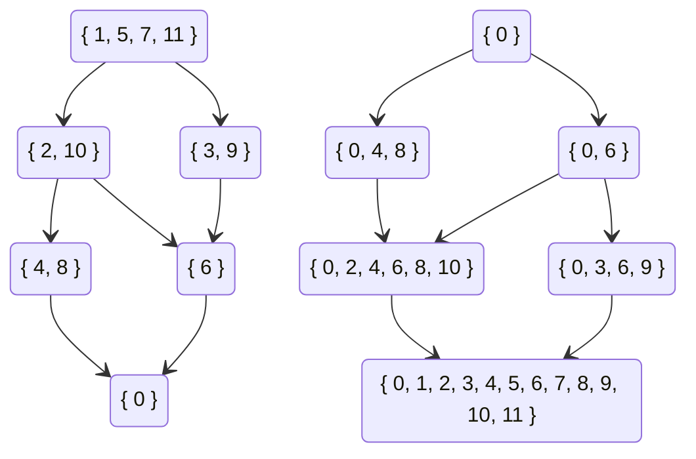

$$
\def\floor#1{\left\lfloor #1 \right\rfloor}
\def\ceil#1{\left\lceil #1 \right\rceil}
$$

## 整除与因子

对于正整数$a,b$，若存在正整数$k$使得$ak=b$，则称$$整除$b$，记作$a|b$。

对于正整数$a,b$，若$a|b$，则我称a$是$b$的因子。

性质1：若$a|b$，则$\frac ba |b$。证明显然。

性质2：对于$n$的任何一个因子$d$，要么$d \leq \sqrt n$，要么$n / d \leq \sqrt n$（当$\sqrt n$是整数时两者均成立）。

通过性质2可以在$O(\sqrt n)$内找到$n$的所有因子。即枚举$\sqrt n$内的所有正整数$d$，检查是否有$d|n$，若是则将$d$和$\frac nd$加入因子集（注意判断是否有$d = n/d$）。

性质3（传递性）：若$a | b, b | c$，则$a | c$。证明显然。

定义（质数）：若正整数$n \geq 2$只有$1$和$n$两个因子，则称$n$为质数（或素数），否则称为合数。

定义（质因子）：若正整数$n$能被质数$p$整除，则称$p$为$n$的质因子。

定理（唯一分解定理）：每个大于$1$的正整数$n$都能唯一的写成一串不递减的素数的乘积。

证明略。

定理（质数定理）：$n$以内的素数数量是$O(n / \ln n)$级别的。证明略。

算法（埃式筛）：

找到$n$以内的所有质数可以在$O(n \log \log n)$的时间复杂度内解决。证明略。

遍历从$2$到$n$的所有正整数，对于每个质数将其所有倍数筛去，这样就得到了原始的埃式筛。

因为所有质数里面只有$2$不是奇数，所以只需要筛掉大于等于$3$的奇合数。

因为大于$2$的偶数不可能是质数，所以对于质数$p$只需要筛掉其奇数倍的数，即$3p,5p,7p,\cdots$。

当找到质数$p$时，所有最小质因子小于$p$的合数均已被筛去，因此接下来第一个未被筛去的$p$的倍数应是$p^2$。

```cpp
vector<int> eratosthenes_sieve(int n) {
    vector<int> primes;
    vector<char> is_prime(n + 1, true);
   	is_prime[1] = 0;
    for (int i = 3; i <= n; i += 2) {
        if (!is_prime[i]) continue;
        primes.push_back(i);
        for (int j = i * i; j <= n; j += 2 * i)
            is_prime[j] = false;
    }
    return primes;
}
```

算法（朴素质因数分解）：

对于合数$n$来说，其大于$\sqrt n$的质因子至多只有一个，所以只需要检查小于等于$\sqrt n$的所有素数是否能够整除$n$。

$\sqrt n$以内的素数可以预处理，因此运行$T$次$O(n)$级别的质因数分解的时间复杂度是$O\left(\sqrt {n} \log \log n+T \sqrt {n / \log n}\right)$。

```cpp
vector<int> prime_factorization(int n) {
    vector<int> factors;
    vector<int> primes = eratosthenes_sieve((int)sqrt(n));
    for (int p : primes) {
        if (p * p > n) break;
        while (n % p == 0) {
            factors.push_back(p);
            n /= p;
        }
    }
    if (n != 1)
        factors.push_back(n);
    return factors;
}
```

## 带余除法与模运算

定义（带余除法）：给定非负整数$a$，正整数$b$，存在非负整数$q,r$满足$a=bq+r(0 \leq r <b)$。其中$q$为商，$r$为余数。

在C++中，`q=a/b`而`r=a%b`。

定义（同余）：对于模数$m$，可以定义一个$\Z$上的等价关系$\equiv_m$，$a \equiv_m b$当且仅当存在整数$k$使得$a+km=b$。一般记作$a \equiv b \bmod m$。

等价关系$\equiv_m$将$\Z$划分成了$m$个剩余类$\bar 0,\bar 1,\cdots ,\overline{m-1}$。

等价类之间可以定义和整数一样的加法和乘法，这里称为模意义下的加法和乘法。

模意义下的加法和乘法满足交换律、结合律、分配律。

命题：若$a \equiv b \bmod m$，则$ka \equiv kb \bmod km$

证明：因为$a=dm+b$，所以$ka=dkm+kb$。

## 欧几里得算法

命题：对于正整数$a,b$，$\gcd (a,b)=\gcd(b, a \bmod b)$。

证明：设$\gcd(a,b)=d_1,\gcd(b, a \bmod b)=d_2$。

由定义得存在$k_1,k_2 \in \Z$使得$a=k_1d_1,b=k_2d_1$，则$a \bmod b=a-\lfloor a/b \rfloor b=(k_1-\lfloor a/b \rfloor k_2)d_1$，因此$d_1|a \bmod b$。所以$d_1 | d_2$。

由定义得存在$k_1,k_2 \in \Z$使得$b=k_1d_2,a \bmod b=k_2d_2$，则$a=a \bmod b+\lfloor a/b \rfloor b=(k_2+k_1\lfloor a/b \rfloor )d_2$，因此$d_2 | a$。所以$d_2 | d_1$。

于是$d_1=d_2$。

算法（欧几里得）：

因为每一轮迭代中$a$与$b$的和至少减少$1$，所以算法一定能够结束。

```cpp
int euclid(int a, int b) {
    if (b != 0) return euclid(b, a % b);
    else return a;
}
```

算法（扩展欧几里得）：

对欧几里得算法进行一些修改可以求得一组系数$u,v$使得$au+bv=\gcd (a,b)$。

设欧几里得算法运行时每一轮迭代参数分别是$a_1,a_2,\cdots a_n$，其中$a_n=0$，$a_{n-1}=\gcd(a,b)$，且对于$i \geq 1$有$a_{i+2}=a_i \bmod a_{i-1}$。

设$a_i=q_i a_{i+1}+a_{i+2}$，其中$q_i=\lfloor a_i / a_{i+1} \rfloor$且$u_ia_i+v_ia_{i+1}=d$，则
$$
u_ia_i+v_ia_{i+1}=u_i(q_ia_{i+1}+a_{i+2})+v_ia_{i+1}=(u_iq_i+v_i)a_{i+1}+u_ia_{i+2}=u_{i+1}a_{i+1}+v_{i+1}a_{i+2}
$$
因此$u_i=v_{i+1},v_{i}=u_{i+1}-q_{i}u_{i}$。

递归终点为$1 \cdot a_{n-1}+0\cdot a_n=\gcd(a,b)$。

注意到有
$$
v_{i}=-q_{i}v_{i+1}+v_{i+2}
$$

$$
v_{n-1}=0 \leq a_{n-1},v_{n-2}=-q_{n-2}v_{n-1}+v_{n}=v_n=1 \leq a_{n-2}
$$

当$i<n$时有$|v_i|=|-q_iv_{i+1}+v_{i+2}| \leq q_i|v_{i+1}|+|v_{i+2}|\leq q_ia_{i+1}+a_{i+2}=a_i$，因此最终得到的$u_i$和$v_i$的绝对值不会超过$a_1$和$a_2$的绝对值。

```cpp
pair<int, int> ext_euclid(int a, int b) {
    if (b != 0) {
        pair<int, int> res = ext_euclid(b, a % b);
        return { res.second, res.first - (a / b) * res.second };
    }
    else return { 1, 0 };
}
```

## 一次不定方程

定义（二元一次不定方程）：形如$ax+by=c$的方程称为二元一次不定方程，其中$a,b,c$已知。

先考虑$c=0$的情况。（不要问为什么）

命题：设$x_0$为使得方程$ax_0+by=0$有整数解$y=y_0$的最小正整数，则对于方程$ax+by=0$的任意解$x,y$均存在$k$使得$x=kx_0,y=ky_0$。

证明：若$ax_1+by_1=0$且$x_0\nmid x_1$，将$x_1$除以$x_0$得$x_1=qx_0+r(0< r < x_0)$，则有$a(x_1-qx_0)+b(y_1-qy_0)=0$。令$x_2=x_1-qx_0,y_2=y_1-qy_0$，显然$x_2=r<x_0,y_2$是比$x_0$更小的正整数解，导出矛盾。因此不存在$x_1,y_1$使得$x_0 \nmid x_1$且$ax_1+by_1=0$，得证。

注意到$b|ax_0$，因此$ax_0$是$a$与$b$的最小公倍数。即$ax_0=\text{lcm} (a, b)=\frac{ab}{\gcd(a,b)}$

命题：不妨设$b>0,d = \gcd (a, b)$，则$x_0=\frac bd,y_0=-\frac ad$。

结论：二元一次不定方程$ax+by=0$的解集是$\{(x,y)|k \in \Z ,x=\frac {kb}{d},y=-\frac {ka}{d}\}$。其中$d=\gcd (a,b)$。

注意到若能够找到任意一组$x^*, y^*$使得$a x^*+by^*=c$，则方程$ax+by=c$的解集可以写成$\{(x,y)|k \in \Z ,x=\frac {kb}{d}+x^*,y=-\frac {ka}{d}+y^*\}$。其中$d=\gcd (a,b)$。

上一节中的扩展欧几里得算法可以用来解决寻找$x^*,y^*$的问题。

运行扩欧后得到$(u,v)$使得$au+bv=d$，若$d \nmid c$则方程无解（证明思路同上）。否则有$x^*=\frac {cu}{d},y^*=\frac{cv}{d}$。

总结一下，二元一次不定方程$ax+by=c$的解集是

$$
\{(x,y)|k \in \Z, x=\frac{kb+cu}{d},y=\frac{-ka+cv}{d}\}
$$

其中$u,v,d$为使用扩展欧几里得算法解$au+bv=d$所得。

## 一次同余方程

模意义下的除法问题可以描述为解一次同余方程$ax \equiv b \bmod m$。

定义（一次同余方程）：对于模数$m$，给定$a,b$求$x$使得$ax \equiv b \bmod m$。

由同余的意义可得，一次同余方程的解集与不定方程$ax + my = b$的解集相同，即$x=\frac{km+bu}{d}$，也可写成$$x \equiv \frac {bu}{d} \bmod \frac md$$

在模$m$的意义下为以下同余类：$$\overline{\frac md+\frac {bu}d},\overline{\frac {2m}d+\frac {bu}d}，\cdots$$

一次同余方程在当$b=1,\gcd(a,m)=1$时一定只有一个解$x$，定义$x$为$a$在模$m$意义下的乘法逆（逆元），记为$x=a^{-1}$。

命题：对于质数$p$，求$1$到$n$内所有数的逆元可用以下递推式求解：
$$
a^{-1}\equiv (p \bmod a)^{-1}(p - \lfloor p/a\rfloor)
$$
设$p=qa+r(0 \leq r <a)$，则
$$
\left((p-q)r^{-1}\right)a=(p-q)r^{-1}(p-r)/q\equiv(p-q)(r^{-1}p-1)q^{-1}\bmod p\\
=r^{-1}q^{-1}p^2-(r^{-1}+q^{-1})p+1\equiv1 \bmod p
$$

递推边界条件为`inv[1]=1`。时间复杂度$O(n)$。

## 一次同余方程组

定义（一次同余方程组）：形如

$$
\begin{cases}
x & \equiv & b_1 \bmod m_1\\
x & \equiv & b_2 \bmod m_2\\
& \vdots &\\
x & \equiv & b_n \bmod m_n
\end{cases}
$$

的方程组被称为一次同余方程组。

命题：一次同余方程组的解是一次同余式。证明略。

定理（中国剩余定理）：当$m_i$两两互质时，方程组有解

$$
x \equiv \sum_{i=1}^{n} b_iu_iv_i \bmod M
$$

其中
$$
M=\prod_{i=1}^{n}m_i,u_i=\frac{M}{m_i},u_iv_i \equiv 1 \bmod m_i
$$

证明：考虑第$i$项，因为$\gcd(u_i, m_i)=1$，所以$v_i$存在且唯一。因为当$i \neq j$时有$m_j|u_i$，所以$b_iu_iv_i \equiv 0 \bmod m_j$，否则有$b_iu_iv_i \equiv b_i \bmod m_i$。因此第$i$项对第$i$个方程的贡献是$b_i$，对其他方程都是$0$。

从另一个角度来考虑，即将两个一次同余方程合并。

考虑不定方程

$$
b_1+k_1m_1=b_2+k_2m_2
$$

移项

$$
k_1m_1-k_2m_2=b_2-b_1
$$

对$m_1u+(-m_2)v=d$运行扩展欧几里得算法解得$u,v,d$

则解为

$$
k_1=\frac{(b_2-b_1)u-km_2}{d},k_2=\frac{(b_2-b_1)v-km_1}{d}
$$

代入原式

$$
b_1+\frac{(b_2-b_1)um_1}{d}-k\frac{m_1m_2}{d}=b_2+\frac{(b_2-b_1)vm_2}{d}-\frac{km_1m_2}{d}
$$

解得

$$
x\equiv b_1+\frac{(b_2-b_1)um_1}{d} \bmod \frac{m_1m_2}{d}
$$

将同余式依次合并至$x \equiv 0 \bmod 1$即可解出模数任意的一次同余方程组。

## 顶和底

定义（顶和底）：给定实数$x$，将$\lfloor x \rfloor$定义为小于等于$x$的最大整数，$\lceil x\rceil$定义为大于等于$x$的最小整数。

命题：对于正整数$a,b,c$有$\lfloor\lfloor a / b\rfloor /c \rfloor=\lfloor a/(bc)\rfloor$。

证明：设$a = q_1b+r_1(0 \leq r_1 <b)$，$q_1=q_2c+r_2(0 \leq r_2 < c)$，因为$a=(q_2c+r_2)b+r_1=q_2bc+r_2b+r_1$，而$r_2b+r_1\leq (c-1)b+(b-1)=bc-1<bc$，所以$\lfloor\lfloor a / b\rfloor /c \rfloor=q_2=\lfloor a/(bc)\rfloor$。

命题：对于正整数$n,x(x \leq \sqrt n)$有$\lfloor n / \lfloor n / x \rfloor \rfloor=x$。

证明：设$n = qx +r(0 \leq r < x),n=tq+s(0 \leq s < q)$。因为$0 \leq r <x \leq \sqrt n\leq q$，所以$s=r,t=x$。

命题：对于正整数$n,x(x<n)$，有$\lfloor n/ \lfloor n/\lfloor n/x\rfloor\rfloor\rfloor=\lfloor n/x\rfloor$。

证明：若$x \leq \sqrt n$，则可将$\lfloor n/\lfloor n/x\rfloor\rfloor$换成$x$。否则$\lfloor n/x \rfloor \leq \sqrt n$，则可将外两层去掉。得证。

命题：对于正整数$n,x(x<n)$，若存在$a$使得$\lfloor n/a\rfloor=x$，则$\max \{ a|\lfloor n/a \rfloor=x\}\leq \lfloor n/x \rfloor$。

证明：设$n=ax+b(0 \leq b < a)=qx+r(0 \leq r < x)$，则$a = (r-b)/x+q \leq r/x+q<x/x+q=q+1$

因此$a \leq q= \lfloor n/x \rfloor$。

命题：对于正整数$n,u(u<n)$，$\max \{v|\lfloor n/v\rfloor=\lfloor n/u\rfloor\}=\lfloor n/\lfloor n/u\rfloor\rfloor$。

因为$\lfloor n/\lfloor n/\lfloor n/u\rfloor\rfloor\rfloor=\lfloor n/u\rfloor$，且由上个命题有$v \leq \lfloor n/\lfloor n/u\rfloor\rfloor$，因此加上条件$x=\lfloor n/u\rfloor$后上一个命题中的等号成立。

命题：对于正整数$n$，集合$S=\{\lfloor n/i \rfloor|1 \leq i \leq n\}$的大小为$2s-[\lfloor i/s\rfloor=s]$，其中$s=\lfloor \sqrt n \rfloor$。

引理：对于正整数$n$，不大于$\sqrt n$的任意两个不相等的正整数$x,y$满足$\lfloor n/x \rfloor \neq \lfloor n/y \rfloor$。

证明：设$n = qx+r(0 \leq r < x)$，则$\lfloor n/x \rfloor=q$。因为$q \geq \sqrt n \geq x > r$，所以$q(x+1)=qx+q>qx+r=n$。所以$\lfloor n/(x+1) \rfloor < \lfloor n/x \rfloor$。不妨设$x < y$，即得$\lfloor n/y \rfloor <\lfloor n/(y-1) \rfloor< \cdots < \lfloor n/x \rfloor$。得证。

算法（整除分块）：由前两个条件可以在$O(\sqrt n)$内求出形如
$$
\sum_{x=1}^{n}f(\lfloor n/x\rfloor)
$$
的和式的值。（若$f$能$O(1)$求得）

因为$\lfloor n/x \rfloor$的取值只有$O(\sqrt n)$种，且对于一个$l$可以直接求出相同取值的右端点$r=\lfloor n/ \lfloor n/l \rfloor \rfloor$。

```
int sum = 0;
for (int l = 1, r; l <= n; l = r + 1) {
	r = n / (n / l);
	sum += (r - l + 1) * f(n / l);
}
```

注：求值范围为$L \leq x \leq R$时也可以只用一次for完成。

## $\Z/n\Z$的结构



$\Z /n \Z$是模$n$意义下的$n$个剩余类与模$n$加法、模$n$乘法组成的代数结构，模$n$剩余类环。这个结构完整的刻画了模运算的性质。

对于模意义下的加法，模$n$意义下的$n$个剩余类构成了一个群$\Z_n$。$\Z_n$同构于循环群$C_n$。

对于$n$的每个因子$d$，由$d$倍数剩余类集合$\{\overline{kd}|0 \leq k < n/d\}$构成了$\Z_n$的子群。这个子群同构于$\Z_{n/d}$，即$C_{n/d}$。

子群之间的包含关系是一个典型的偏序关系，由此可以画出哈斯图。如上面的$\Z_{12}$。

关于加法的性质比较简单，接下来将主要分析乘法的性质。

将$\Z_n$中的每个元素视作一张有向图中的点，并对于$x$将所有$u$连向$xu$，可以得到一张有向图。

### $\Z_n$中元素的阶

对于$\Z_n$中所有与$n$互质的元素，其与模$n$意义下的乘法形成了一个群$\Z_n^\times$。

由欧拉函数的定义，这个群的大小为$\varphi(n)$。

定义（元素的阶）：给定有限群$G$，对于$g \in G$，定义$g$的阶为使得$g^x=e$的最小正整数$x$，即
$$
\text{ord}(g)= \min_{x \in \N^+,g^x =e} x
$$
性质：$\Z_n^\times$中每一个元素的阶数都是群大小$\varphi(n)$的因子。由关于子群阶数的拉格朗日定理显然。

给定任意一个与$n$互质的$a$，若要求$a$模$n$的阶，最朴素的做法是依次计算$a$的幂。时间复杂度$O(n)$。

由上面的性质可以得到一个在给定$n$的质因数分解的前提下求元素阶数的对数时间算法。

设$\displaystyle \text{ord}(a)=\prod_{i=1}^kp_i^{\alpha_i},\varphi(n)=\prod_{i=1}^kp_i^{\beta_i}$，目标即计算每个$\alpha_i$。考虑到$\text{ord}(a^{p_i})=\text{ord}(a)/p_i$，因此有
$$
\text{ord}(a^{p_i^k})=\text{ord}(a)/p_i^{\min(k,\alpha_i)}
$$
因为有$\beta_i \geq \alpha_i$，所以
$$
\text{ord}(a^{p_i^{\beta_i}})=\text{ord}(a)/p_i^{\min(\alpha_i,\beta_i)}=\text{ord}(a)/p_i^{\alpha_i}
$$
因此
$$
\text{ord}(a^{\varphi(n)/p_i^{\beta_i}})=p_i^{\alpha_i}
$$
问题转化为求$a^{\varphi(n)/p_i^{\beta_i}}$的阶。因为有$0\leq \alpha_i \leq \beta_i$，所以对于每个$i$遍历所有可能的$\alpha_i$即可。

时间复杂度$O(\displaystyle \log n\sum_{i}\beta_i)=O(\log^2 n)$。

```
struct pf { ll p, e, q; };	//	pow(p,e)=q
vector<pf> prime_factorization(ll n);
ll qpm(ll a, ll b, ll m);	//	returns pow(a, b) bmod m
ll phi(ll n);

//	phn = phi(n), pfs = prime_factorization(phi(n))
ll ord(ll n, ll phn, const vector<pf>& pfs, ll g) {
    ll res = 1;
    for (pf p : pfs)
        for (ll t = qpm(g, phn / p.q, n); t != 1; res *= p.p)
            t = qpm(t, p.p, n);
    return res;
}
```

定理（Euler）：
$$
\forall a,\gcd(a,n) =1 \Rightarrow a^{\varphi(n)}=\left(a^{ord(a)}\right)^{\varphi(n)/ord(a)}=1^{\varphi(n)/ord(a)}=1
$$
因此有
$$
\forall a, \gcd(a,n)=1 \Rightarrow a^b \equiv a ^{b \bmod \varphi(n)} \bmod n
$$
此即欧拉降幂。

这个定理同时提供了求逆元的另一个思路（区别于扩展欧几里得）。即当$\gcd(a,n)=1$时有
$$
a^{-1} \equiv a^{\varphi(n)-1} \bmod n
$$

### 扩展欧拉降幂

那么当$\gcd(a,n) \neq 1$的时候呢？

这里只考虑$b \geq \varphi(n)$的情况。设$\displaystyle a=m\gcd(a,n)=m\prod_{i=1}^kp_i^{\alpha_i},n=\prod_{i=1}^kp_i^{\beta_i}$，其中$\gcd(m,n)=1$。
$$
a^b\equiv m^{b \bmod \varphi(n)}\left(\prod_{i=1}^kp_i^{\alpha_ib}\right) \bmod \prod_{i=1}^kp_i^{\beta_i}
$$

左半部分已经解决，考虑右半部分。对每个$p_i$分别解决。

注意到$p_i^x \bmod wp_i^r$关于$x$一定存在循环节（考虑一个每个点出度均为1的有向图），这里$\gcd(w,p_i)=1$。

存在引理：
$$
p_i^{b} \equiv p_i^{b \bmod \varphi(n)+\varphi(n)} \bmod n
$$
证明：

设$n=w p_i^r$，其中$\gcd(w,p_i)=1$，则有
$$
p_i^{\varphi(n)}\equiv \left(p_i^{\varphi(w)}\right)^{\varphi(n)/\varphi(w)}\equiv1 \bmod w
$$
两边同乘$p_i^r$得
$$
p_i^{\varphi(n)+r}\equiv p_i^r \bmod n
$$

将两边指数同时加上$1,2,\cdots$即可得到

命题：当$b \geq r$时，有
$$
p_i^{b}\equiv p_i^{b+\varphi(n)} \bmod n
$$
这意味着当$b \geq r+\varphi(n)$时，可以将$b$替换为$b-\varphi(n)$。

通过一个对$r$的放缩即可得到更好用的形式（不用专门求$r$且对降幂复杂度没有显著影响）。

命题：设$n=\displaystyle \prod_{i=1}^k p_i^{\beta_i}$，有$\varphi(n) \geq \beta_i$。

证明：

因为$\varphi(p_i^{\beta_i})\geq \beta_i$加上显然的$\varphi(n) \geq \varphi(p_i^{\beta_i})$可以推出$\varphi(n) \geq \beta_i$，所以对仅有一个质因子的$n$证明即可。

因为$\varphi(p_i^{\beta_i})=p_i^{\beta_i-1}(p_i-1)$关于$p_i$单调增，所以$p\geq q$则$\varphi(p^k)\geq \varphi(q^k)$，所以对$p=2$证明即可。

对于$p=2$显然有$2^{k-1}-k\geq 0$，证毕。

由此可得更通用的形式：当$b \geq \varphi(n)$时
$$
p_i^{b} \equiv p_i^{b \bmod \varphi(n)+\varphi(n)}
$$
因为$\alpha_i \geq 1$，所以有
$$
p_i^{\alpha_ib}\equiv p_i^{\alpha_i b \bmod \varphi(n)+\varphi(n)}
$$
所以
$$
a^{b}\equiv m^{b \bmod \varphi(n)}\left(\prod_{i=1}^kp_i^{\alpha_ib \bmod \varphi(n)+\varphi(n)}\right) \bmod n
$$
因为$\gcd(m,n)=1$，所以$m^{\varphi(n)} \equiv 1 \bmod n$，所以

定理（扩展欧拉降幂）：对于任意$a,b,n \geq 1$有
$$
a^b \equiv 
\begin{cases}
a^{b \bmod \varphi(n)} & \gcd(a,n) =1\\
a^{b} & \gcd(a,n) \neq 1 \wedge b < \varphi(n)\\
a^{b \bmod \varphi(n)+\varphi(n)} \bmod n & \gcd(a,n) \neq 1 \wedge b \geq \varphi(n)
\end{cases}
$$

定理（Bauer）：

(1): 如果$p$是$m$的一个奇素因子，且$p^\alpha$是$p$能整除$m$的最高幂次，则有
$$
\prod_{i,\gcd(m,i)=1}(x-i)\equiv(x^{p-1}-1)^{\varphi(m)/(p-1)} \bmod p^\alpha
$$
(2): 如果$m$是偶数，且$2^\alpha$是$2$能整除$m$的最高幂次，则有
$$
\prod_{i,\gcd(m,i)=1}(x-i)\equiv(x^{2}-1)^{\varphi(m)/2} \bmod 2^\alpha
$$

